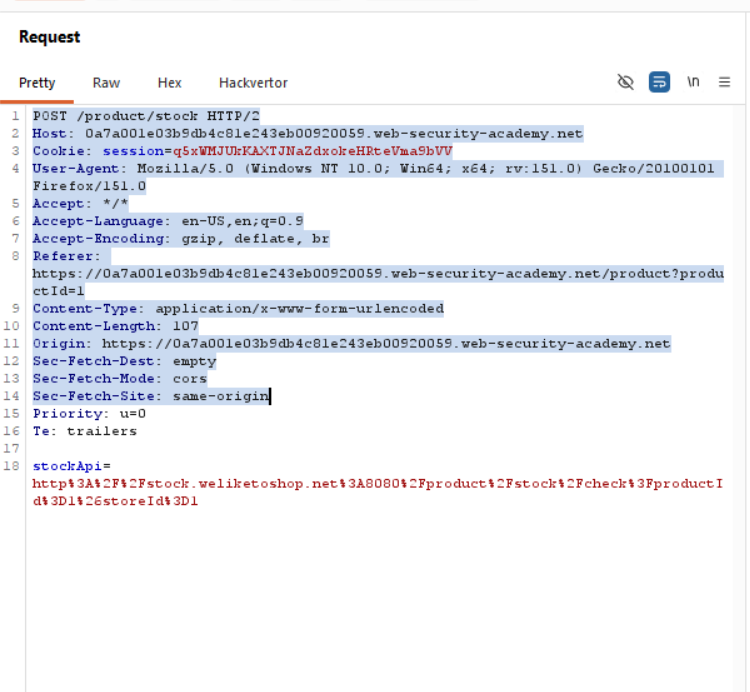
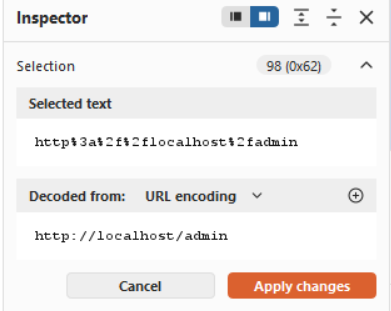

Title: Basic SSRF against the local server

Objective: change the stock check URL to access the admin interface at http://localhost/admin and delete the user carlos. 

as given in the description we will check the stock of product and send it to the repeater 

as we can see we have url of a stockapi we can tamper it to get the access to the admin panel

clicl send to see the admin panel to delete the user carlos do the changes /admin/delete?usename=carlos
