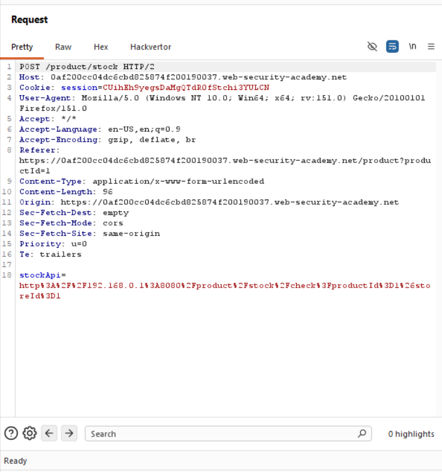
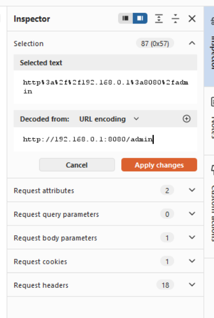
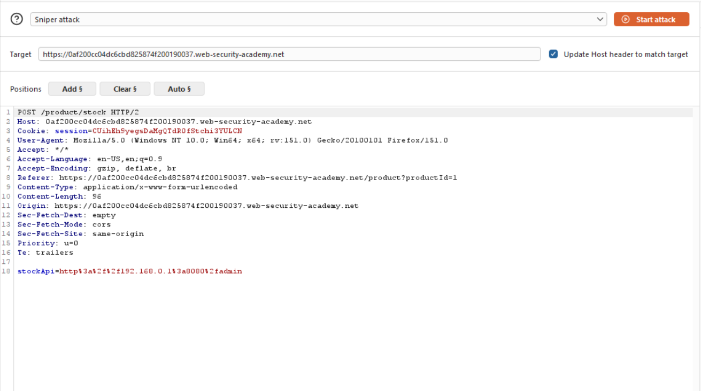
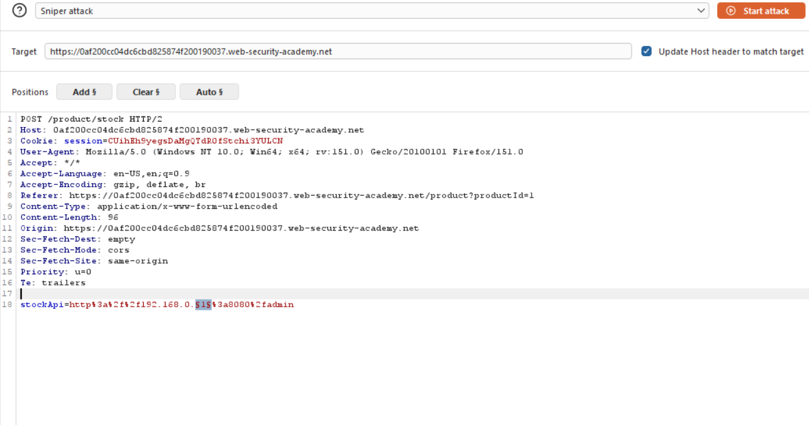
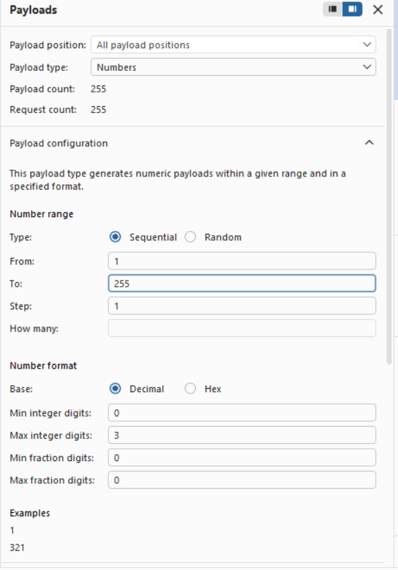
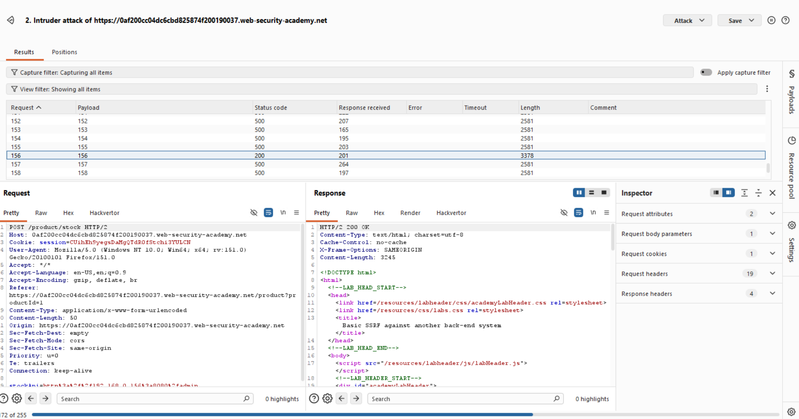
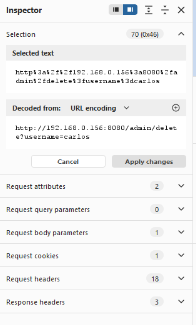

Title:Basic SSRF against another back-end system

Objective: use the stock check functionality to scan the internal 192.168.0.X range for an admin interface on port 8080, then use it to delete the user carlos. 

we will first send the stock request to the repeater.

then we will change the stock API as follows:

we still don't know which system does the admin reside so we will send this request to the intruder and check for each device .

then we will add the $$ on 192.168.0.$1$ and then initiate the sniper attack :

we will change the payload settings as follows:

the we start the attack and when we get the 200ok message it means that we found the right device.

with this we go the ip of admin as 192.168.0.156 so now we delete carlos by changing the url as follows:

and then send to complete the lab.

