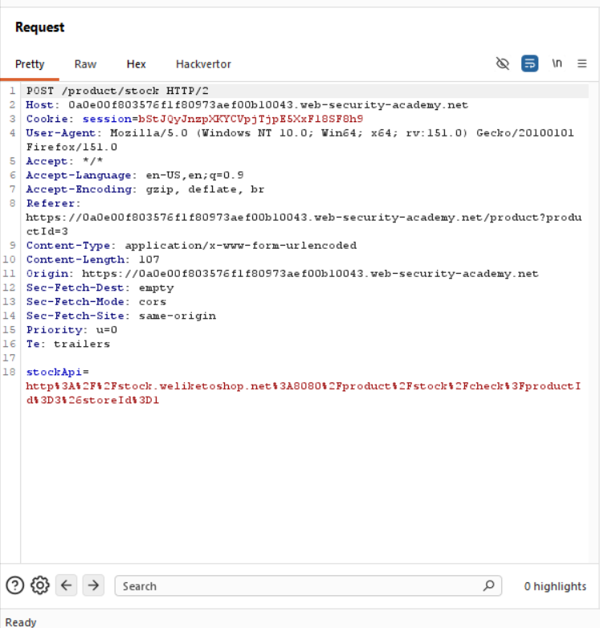
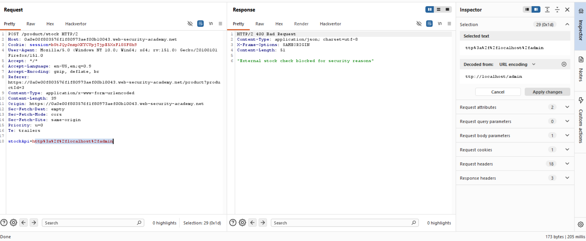
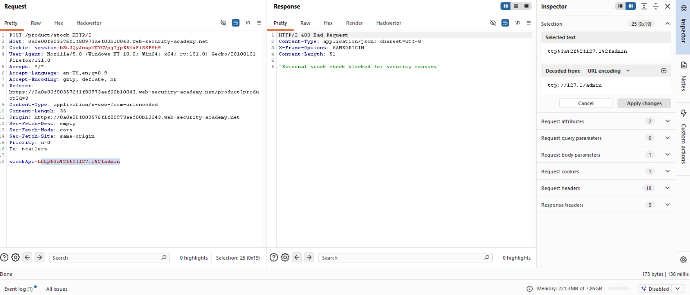
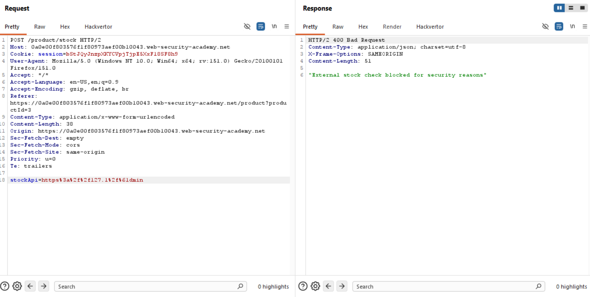
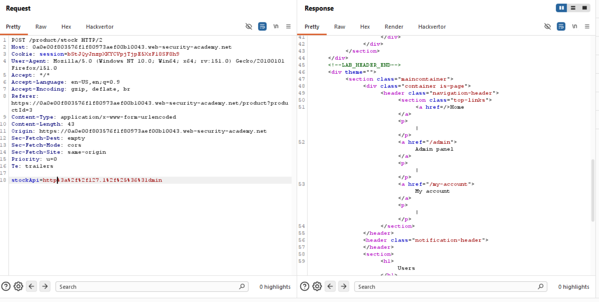
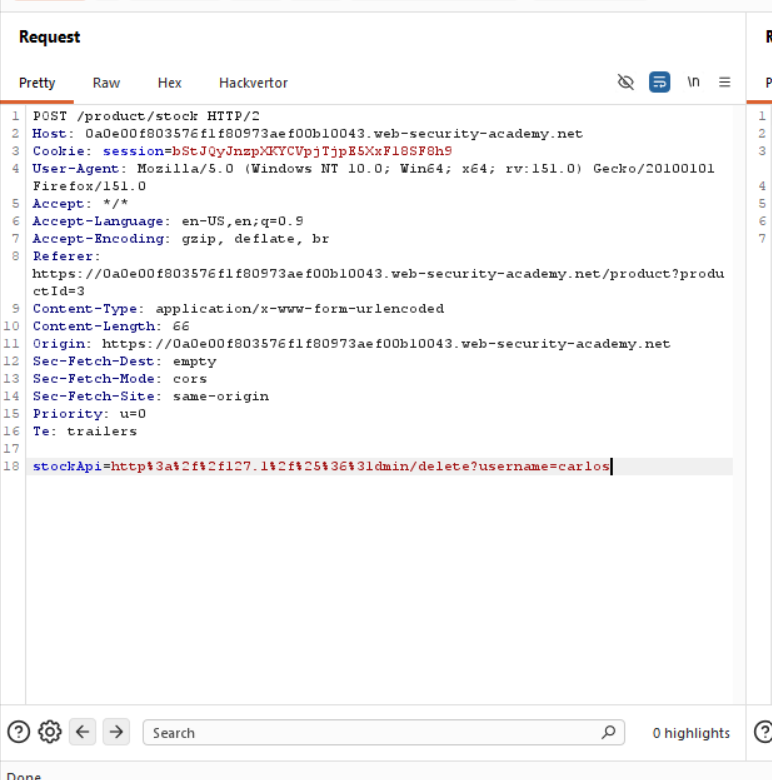

Title:SSRF with blacklist-based input filter

Objective: , change the stock check URL to access the admin interface at http://localhost/admin and delete the user carlos.

we will first send the stock request to the repeater.

when we use localhost we get an resriction :

we will ise 127.1 in teh place of local host:

we still got 400 bad request lets url encode the a in admin(%61)  to see if we can get the access:

we still got a 400 bad request so we double url encode a (%25%36%31):

now we got a 200 ok message and can see the admin panel to delete the user carls just add /delete?username=carlos to the stockapi

with this you have solved the lab.

